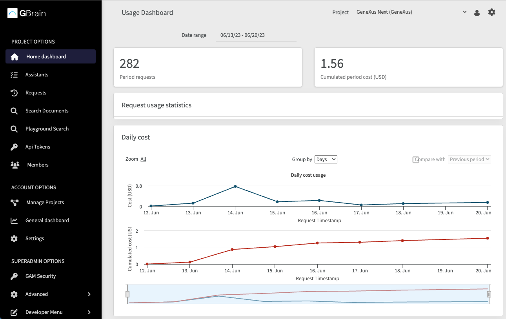

# GBrain Backoffice

Table of contents
=================

* [Introduction](#introduction)
* [Projects](#projects)
* [Members](#members)
* [Assistants](#assistants)
   * [Creating a Prompt Assistant](#creating-a-prompt-assistant)
   * [Creating a Chat Assistant](#creating-a-chat-assistant)
* [Search domains](#search-domains)
* [Observability](#observability)
  * [Requests](#requests)   
* [API Tokens](#api-tokens)

## Introduction

Welcome to GBrain backoffice. This backoffice provides organization administrators with a range of essential options to configure projects and manage key settings. Through the GBrain backoffice, you can easily customize projects, define and test assistants, define search domains, generate API tokens, manage members, and adjust observability options. 

This documentation will guide you through the several features and functionalities of the GBrain backoffice.

When accessing the GBrain backoffice, a dashboard is shown on the home screen. This dashboard displays essential indicators related to usage and costs for the selected project. 

At the right top of the header, you can select the project you want to view. After selecting a project, the information shown on the dashboard is filtered as well as all the options offered in the left menu. In addition, next to the project name you can find a user menu to access user-specific tasks and a configuration menu that allows you to customize settings such as dark mode or font size.

On the left side of the screen, you can find the backoffice menu, which grants access to different options based on your credentials. This menu enables you to navigate through the several features and functionalities offered by the GBrain backoffice.

## Projects
Projects are the core entities where several configurations and settings are defined. Within each project, you can define assistants, generate API tokens for API access, and carry out document management functionalities. You can also add, update, or delete projects within the organization.

The following sections will guide you on how to perform project-related operations within the GBrain backoffice, empowering you to efficiently manage projects and their associated settings.

### Adding a project
To define a new project, follow the steps below:

1. Access the GBrain backoffice interface and log in with your organization administrator credentials.

2. Once logged in, select "Manage Projects" in the left menu.

3. Click on the "New Project" button.

4. In the project creation form, provide the following information:

   - Project Name: Enter a meaningful and descriptive name for the project.
   - Project Description: Briefly summarize the purpose or objective of the project.

5. After entering the necessary information, click on the "Confirm" button to save the project details.

Congratulations! You have successfully created a new project using the GBrain backoffice. Now, you can proceed to configure assistants, define API tokens, and manage document management settings for this project.

Note: It is recommended to choose project names and descriptions that accurately reflect the intended purpose and scope of the project. This facilitates better organization and improves clarity for all users involved in project management.

### Set as active
You have the option to set a specific project as the active project. This feature allows you to define which project will be used as a filter for all options that require project-specific filtering. To do so, you can select the "Set as Active" option or select a project in the combo box that contains the projects list.

Upon setting a project as active, all subsequent actions and filters within the GBrain backoffice will be applied specifically to that project. 

## Members
The Members option, available in the backoffice menu (located on the left side of the screen), enables you to add new members to the selected project. Adding members allows you to grant individuals access and involvement in the project's activities. 

To invite a new member, you only need to specify their email address, follow the steps below:

1. Access the GBrain backoffice interface and log in with your organization administrator credentials.

2. Once logged in, select the project to which you want to add members.

4. Go to the "Members" option.

5. Press the "Add Member" button.

6. Enter the email address of the user you want to invite as a new member.

7. Click on the "Invite Member" to send the invitation.

An invitation email to the specified user will be sent to join the project. Once the invited user accepts the invitation, they will gain access to the project.

Note: Make sure to provide the correct email address of the user you want to invite.

## Assistants
You can define two types of assistants: 

- Prompt assistants for text completion
- Chat assistants for interactive conversations

This section will guide you through the process of creating both types of assistants.

### Prompt Assistant creation

To create a Prompt assistant, follow these steps:

1. Access the GBrain backoffice interface and log in with your organization administrator credentials.

2. Go to the "Assistants" section.

3. Click on the "Create Prompt Assistant" link.

4. Complete the required details:

   - Name: Give a unique name to your Prompt assistant.
   - Assistant Prompt: Specify the initial prompt or context for the assistant to generate text completion.
   - AI Provider: Select the desired AI provider, such as OpenAI, Google VertexAI, etc.
   - AI Model: Choose the specific AI model to be used for text completion.
   - Max Tokens: Configure the maximum number of tokens to return in the generated text completion, based on the chosen AI model.

5. Optionally, test the assistant before saving it. This helps you evaluate the response generated by the assistant based on the provided initial context prompt and settings.

6. Once you are satisfied with the response, save the first version of your Prompt assistant.

### Chat Assistant creation

To create a Chat assistant, follow these steps:

1. Access the GBrain backoffice interface and log in with your organization administrator credentials.

2. Go to the "Assistants" section.

3. Click on the option to Create Chat Assistant.

4. Fill in the required details:

   - Name: Give a unique name to your Chat assistant.
   - System: Specify the initial instruction or response that the assistant should provide during conversations with users.
   - AI Provider: Select the desired AI provider, such as OpenAI, Google VertexAI, etc.
   - AI Model: Choose the specific AI model to be used for the chat interactions.

5. Optionally, test the assistant before saving it. This allows you to verify the response generated by the assistant based on the initial system instruction and selected AI settings.

6. Once you are satisfied with the response, save the first version of your Chat assistant.

Note: When creating prompt or chat assistants, ensure that the instructions, prompts, or initial context provided are clear and concise to obtain accurate and meaningful responses from the AI models.

## Search domains

## Observability
GBrain stores and tracks every request made through its API layers, providing organizations with complete visibility into the usage of assistants, AI models, and the associated cost for each request. This allows organizations to monitor and analyze resource usage, make informed decisions about resource allocation and optimize usage for cost-efficiency. 

With clear visibility into both usage and cost, organizations can effectively manage their AI-driven workflows, control expenses, and maximize their return on investment. 

By taking advantage of these features, organizations can maintain control over their AI infrastructure, identify areas for improvement, and make data-driven decisions to enhance operational efficiency.

### Requests
In the left menu of GBrain the "Requests" option gives you access to a comprehensive trace that provides complete observability for each request made. 

The trace allows you to easily filter requests by model, assistant, API token, datetime range, and status, enabling you to quickly identify specific requests of interest. Furthermore, by clicking on the Module column for a particular request, you can access detailed information about that request.

Within the request details, you can view the input and output data, the specific model used for the request, the associated cost, and the timestamp indicating when the request was executed. This level of detail enables you to gain insights into the specific details of each request, facilitating troubleshooting, analysis, and optimization of your AI workflows.

The ability to access and review the complete details of each request empowers you to understand the underlying data and processes, making it easier to identify and address any issues or areas for improvement. With this comprehensive observability feature, organizations can ensure the accuracy, efficiency, and cost-effectiveness of their AI-driven workflows in GBrain.

## API Tokens
API Tokens play a crucial role in executing GBrain APIs. These tokens are required to access and use the functionality provided by the APIs. 

For each project, you can define multiple API Tokens. This allows for granular control and tracking of usage, as well as the management of access permissions for specific assistants or models available through the GBrain API.

By defining API Tokens for each assistant, you can conveniently monitor the usage of assistants individually and gain insights into their performance and resource usage. Moreover, the ability to assign API Tokens to specific projects and assistants allows for fine-grained access control, ensuring that only authorized individuals or systems can execute requests on behalf of the defined assistants or models.

With this level of granularity, organizations can effectively manage access permissions, track usage patterns, and maintain control over their assistants and models within the GBrain API.
