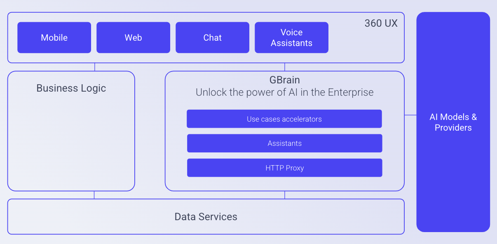

Table of contents
=================

* [Overview](#Saia-the-ai-brain-for-your-enterprise-applications)
* [API Reference](docs/apis/APIReference.md)
* [Backoffice](docs/Backoffice.md)

# Saia: the Spine of AI  Applications

Enterprise applications utilizing Large Language Models (LLMs) as a foundation are now a reality. These AI applications, designed to be integrated into production environments, require a set of essential non-functional and functional characteristics for business applications. 

## Non-functional Characteristics 
- Observability 
- Maintainability, future proofing 
- Security 
- Scalability
- Accountability

## Functional Characteristics 
- Search & Chat for private documentation 
- Intent-based navigation for existing user interfaces 
- Assistants for power autocomplete 
- Definition and chaining of assistants and actuators 
- Autonomous or semi-autonomous execution agents 

From a process perspective, it is also crucial to consider development elements such as versioning assistants, testing assistants, and deploying them. 

Saia was designed with an architecture of multiple logical layers which can be accessed independently and incrementally.

So you can just start by just consuming some particular model, but then conceptualize those accesses as assistants and then as a use case.

# What problems does Saia solve with a unique time to market? 

+ Centralized data and cost observability 
+ Development of POCs (Proof Of Concept) or products that quickly “cognifying” business, reducing costs or time for a specific business area 
+ Time to market for AI solutions in a safe and scalable manner 
+ Canonical use cases for AI solutions: 
  - Intent-based navigation 
  - Search & Chat 
  - Autocomplete 
  - Business assistant-based processing conceptualization 

## Observability 

It is essential to understand the information lifecycle and be able to measure various business indicators regarding the use and costs of the AI models being utilized. 
Business applications need to understand which business domains are using which AI models. 

## Maintainability, Future Proofing 

AI models are evolving rapidly. Can businesses keep up with the pace? Can our interfaces fluctuate and test each model without breaking connection interfaces? How can we become independent of these decisions, often tied to cost, privacy, or other factors? 
Saia allows for the independence of created interfaces from the accessed models, enabling agents to evolve with a business perspective, separate from the underlying AI models' evolution. 

## Security 

Businesses require access security, data security, data governance, and alerts for potential rule breaches. Saia provides everything needed to achieve control over what happens with data within the company, ensuring data travels securely and adheres to business-imposed rules. 

## Scalability 

Performance should not degrade with business success. Having infrastructure designed for secure and scalable communication with models is essential when deploying products in production. Using Saia ensures that if the business succeeds, scalability concerns are addressed. 

## Built-in Patterns Solved 

Saia provides all the services and abstractions necessary for implementing emerging UX patterns. It offers the following services: 

- Search & Chat creation for any document set, essentially building a private ChatGPT for unstructured company documents 
- Assistant creation and chaining for various business objectives 
- Autocomplete assistants 
- Summarization assistants 

## Testing your assistants

Saia allows you to version all your assistants, this is a great feature that allows you to evolve assistants without breaking things.
You need to be aware that programming with non-deterministic agents could be a challenge without help.

By using Saia you can declare different versions of your assistants and start enabling different access to them depending on the consumer.

You can create a complete regression test suite with the new version of a new assistant before entering production. Actually, you can match your current staging planning in order to evolve your solution with confidence.

## Access to Saia 

Access to Saia's various layers is generally programmable using any programming language. Access is granted via access tokens per project or organization. 
In addition to programmatic interfaces, you can quickly create Playgrounds for demonstrating AI technology capabilities. 
