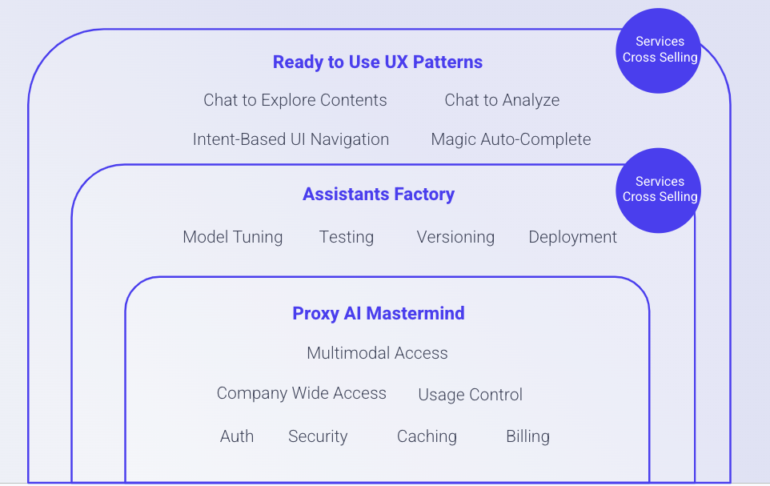

# SAIA API Reference

Table of contents
=================

* [Introduction ](#introduction)
* [Authentication ](#authentication)
* [Errors ](#errors)
* [Versioning ](#versioning)
* [Proxy AI API](../ProxyOverview.md)
* [Assistants API](AssistantsAPI.md)
* [Search and Chat API](SearchAndChatAPI.md)
* [Organization API](OrganizationAPI.md)
* [Search Profile API](SearchProfileAPI.md)

# Introduction
The API has three main layers, each with its specific functions and features. The first layer handles all communication and manages all calls made to different AI providers. The second layer is responsible for defining and configuring assistants according to your specific needs. Finally, the third layer includes an accelerator that streamlines common functions such as chatting, searching or intent-based navigation. 

By understanding the functionality of each layer, you can better leverage the API's capabilities in your application and provide a more seamless experience to your users.

Follow these links to see more details about each API layer:
* [Proxy AI API](../ProxyOverview.md)
* [Assistants API](AssistantsAPI.md)
* [Search and Chat API](SearchAndChatAPI.md)

## Authentication
In order to use our API, you need to authenticate each request using API Tokens. These tokens are managed in SAIA [backoffice](Backoffice.md) and uniquely identify the sender of the request.

To authenticate your requests, you need to provide your token via HTTP Basic Auth. This means that your token is encoded in the username field, and the password field should be left empty. Once authenticated, you will be able to access all endpoints within your API scope.

For security purposes, we strongly recommend that you do not share your API tokens with anyone and revoke them immediately if they are compromised.

# Errors
Our REST API employs the widely accepted practice of using HTTP response codes to convey the status of an API request. The codes in the 2xx range indicate that the request was successful and the server has returned the expected data. On the other hand, the codes in the 4xx range signify that the request failed because of a client-side error, such as missing or invalid parameters, unauthorized access, or any other fault in the request. The codes in the 5xx range suggest that there's an error on the server-side, and the request couldn't be completed due to a server malfunction or connectivity issues. Such errors, fortunately, are infrequent in our service.

By following these HTTP response codes, users can easily understand whether their API requests have succeeded or failed, and the probable causes of failure if there are any.

## Versioning
Our API versioning strategy is designed to minimize disruptions to your application when backwards-incompatible changes are introduced.

Whenever we make such changes to the API, we release a new version of it. This approach allows you to continue using the previous version of the API until you are ready to upgrade to the latest version.

We strongly recommend that you always specify the version number when making API requests to ensure the correct behavior of your application. You can find the latest version number in the documentation or by contacting our support team.

By using versioning, we can ensure that your application remains stable and functional, while still providing access to the latest API features and functionality.
